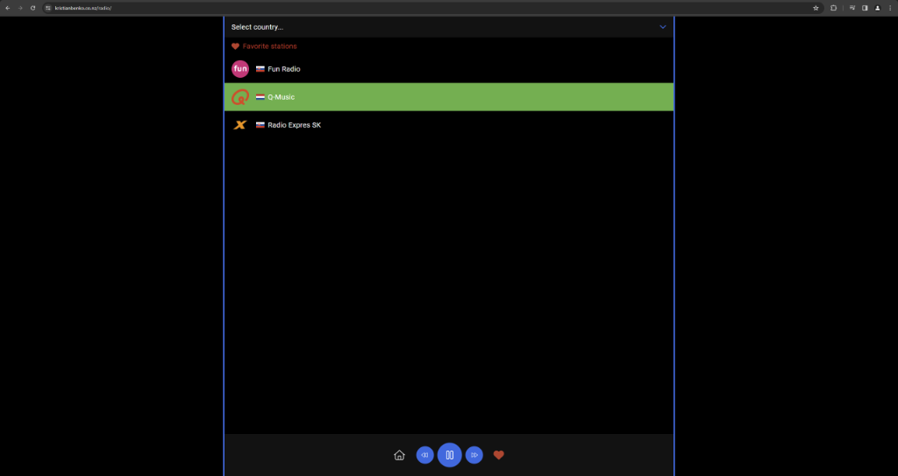
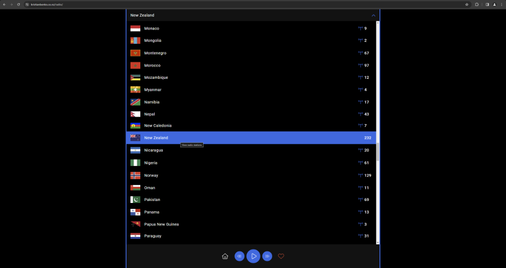
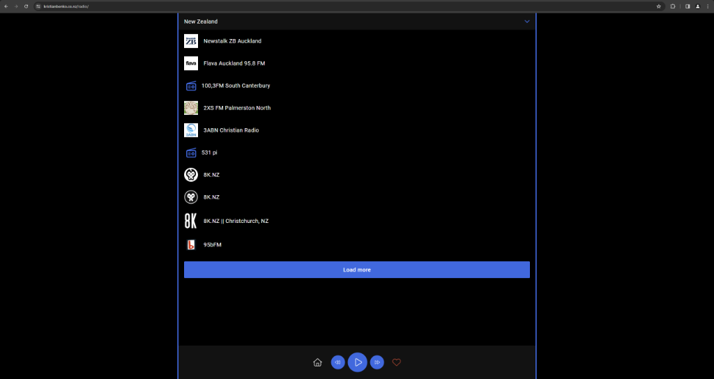

# Internet Radio Web App

## What is this project?

This project is a modern web application that allows users to browse and listen to internet radio stations from around the world. Users can select stations by country, play/pause streams, and manage a list of favorite stations—all from a clean, responsive interface.

### Home Interface: Favorites

The home screen provides quick access to your favorite radio stations. You can easily add or remove stations from your favorites, and they’ll be saved for your next visit.



### Country Selection

Selecting a country is simple and visually engaging. The country picker displays flags and station counts, making it easy to explore stations from anywhere in the world.



### Stations Within a Country

After choosing a country, you’ll see a list of available radio stations for that region. Each station can be played instantly, and you can browse, play, and favorite as you wish.



## Why I built it

I built this project to solve the problem of discovering and listening to global radio stations in a simple, user-friendly way. Many radio apps are cluttered or limited in their station selection. My goal was to create a fast, intuitive experience that makes it easy to explore music and talk radio from any country, while also learning more about full-stack web development and API integration.

## Technologies and Tools Used

- **Node.js** and **Express** for the backend server
- **JavaScript** (ES6+) for all client-side logic
- **HTML5** and **CSS3** for the frontend UI
- **FontAwesome** for icons
- **find-free-ports** and **node-fetch** for server utilities
- Custom utility code in `general.js` (my personal library)

## How it works

### Backend: Serving Radio Data

The backend uses Express to serve radio station and country data, fetched from the [radio-browser.info](https://www.radio-browser.info/) API. Here’s a simplified version of the server logic:

```js
const express = require('express');
const fetch = require('node-fetch');
const findFreePorts = require('find-free-ports');
const dns = require('dns');
const util = require('util');
const resolveSrv = util.promisify(dns.resolveSrv);
const app = express();

const radio = {
  stations: null,
  countries: null,
  async init() {
    let baseUrls = await resolveSrv("_api._tcp.radio-browser.info");
    let APIurl = `https://${baseUrls[Math.floor(Math.random() * baseUrls.length)].name}`;
    let fetchData = await fetch(`${APIurl}/json/stations`);
    radio.stations = await fetchData.json();
    fetchData = await fetch(`${APIurl}/json/countries`);
    radio.countries = await fetchData.json();
  }
};

(async () => {
  await radio.init();
  // ...existing code...
  app.listen(port, () => {
    console.log(`Server started on port ${port}`);
  });
})();
```

### Frontend: User Experience

The frontend is a single-page app that dynamically loads countries and stations, lets users play/pause audio, and manage favorites. Here’s a snippet showing how stations are displayed and played:

```js
// ...existing code...
displayStations(country) {
  // ...existing code...
  index.countryStations = index.stations.filter(station => station.country === index.currentCountry);
  // ...existing code...
  for (let station of index.countryStations) {
    // ...existing code...
    el = strToEl(`
      <div class="station" stationuuid="${station.stationuuid}" title="Play this station">
        <div class="icon">
          ${icon}
        </div>
        <div class="name">
          <span>${station.name}</span>
        </div>
      </div>
    `);
    // ...existing code...
    listener.add(el, 'click', (e) => {
      index.playPause(false);
      // ...existing code...
      index.audio.setAttribute('src', index.playingStation.url);
      index.playPause(true);
    });
    // ...existing code...
  }
}
```

### Favorites Feature

Users can add or remove stations from their favorites, which are stored in localStorage for persistence:

```js
favoriteClicked() {
  if (index.playingStation === null) {
    return;
  }
  if (index.favoriteStationIds.includes(index.playingStation.stationuuid)) {
    // Remove from favorites
    index.favoriteStationIds.splice(index.favoriteStationIds.indexOf(index.playingStation.stationuuid), 1);
    // ...existing code...
  } else {
    // Add to favorites
    index.favoriteStationIds.push(index.playingStation.stationuuid);
  }
  // ...existing code...
  localStorage.setItem('favoriteStations', JSON.stringify(index.favoriteStationIds));
}
```

### Responsive and Modern UI

The UI is styled with custom CSS for a clean, modern look, and adapts to both desktop and mobile screens.

## What I Learned

Building this project deepened my experience with:
- Full-stack JavaScript development
- Consuming and integrating third-party APIs
- Designing responsive, user-friendly interfaces
- Managing state and user preferences in the browser
- Writing reusable utility code (see `general.js`)

If you’d like to know more about the project, feel free to reach out!
